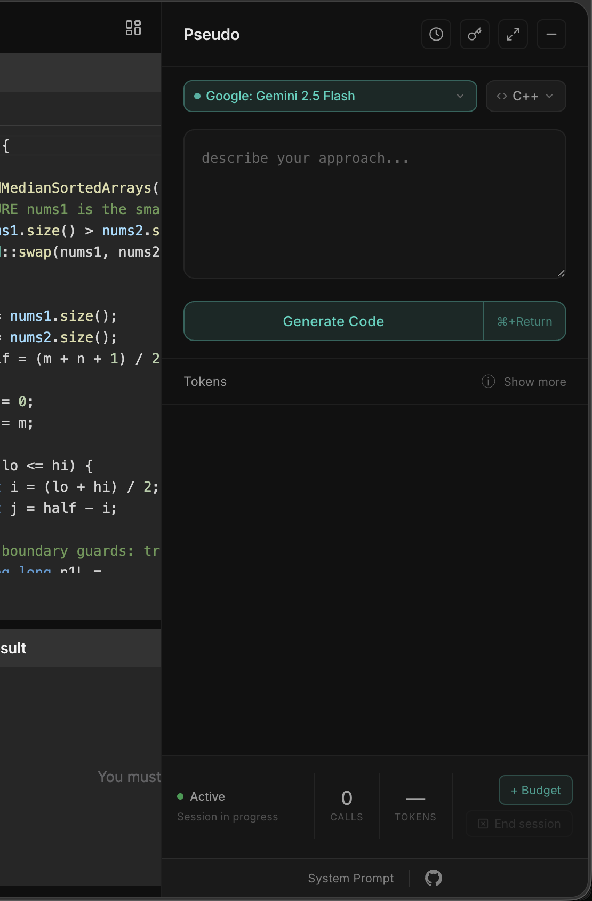
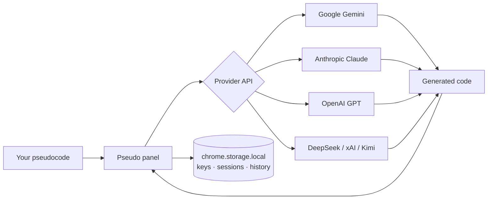

# Pseudo

**Write pseudocode. Get code. Measure how efficiently you used AI.**

Pseudo is a Chrome extension that lives as a side panel on coding platforms. Describe your approach in plain English — Pseudo converts it to working code using the AI model of your choice, directly from your browser with your own API key.



---

## Why Pseudo

Most AI coding tools hand you the answer. Pseudo is built for **practice** — it transcribes your logic as-is, bugs and all, so you stay in control of the thinking. It also tracks every token you spend per problem, computing **Resource Units** so you can compare how much compute different approaches consume.

---

## Features

| | |
|---|---|
| 🧠 **Pure transcription** | Implements your pseudocode exactly — never fixes, optimises, or second-guesses your approach |
| 🔑 **Your keys, your models** | Bring your own API key for any supported provider — no Pseudo backend, no middleman |
| 📊 **Token tracking** | Exact input/output/thinking token counts per call, and cumulative session totals |
| 🔋 **Resource Units** | Compute-weighted session cost: model size × tokens. Output tokens count 3× more than input — mirrors real inference cost |
| 💰 **Token budget** | Set an optional token limit per session to practice under constraint |
| 📜 **Session history** | Last 50 sessions stored locally with Resource Units, iteration counts, and pseudocode snippets |
| ↔️ **Wide / narrow toggle** | 400 px or 800 px panel width for side-by-side or focused mode |
| 🔒 **100% local** | API keys, session data, and history never leave your browser |

---

## Supported Providers & Models

| Provider | Models |
|---|---|
| **Google / Gemini** | Gemini 3.5 Flash · Gemini 3.1 Pro Preview · Gemini 2.5 Flash ★ |
| **Anthropic** | Claude Opus 4.8 · Claude Sonnet 4.6 · Claude Haiku 4.5 |
| **OpenAI** | GPT-5.5 · GPT-5.4 Mini · GPT-4.1 Mini ★ |
| **DeepSeek** | DeepSeek V4 Pro · DeepSeek V4 Flash |
| **xAI** | Grok 4.3 · Grok Build 0.1 |
| **Moonshot AI** | Kimi K2.6 |

★ = stable fallback recommended for reliability. Models are fetched live from OpenRouter (24 h cache) and filtered against a curated allowlist.

---

## Supported Platforms

Pseudo auto-activates on these coding platforms (and can be opened manually on any page via the toolbar icon):

| Platform | URL pattern |
|---|---|
| LeetCode | `leetcode.com/problems/*` |
| Codeforces | `codeforces.com/problemset/problem/*` · `codeforces.com/contest/*/problem/*` |
| HackerRank | `hackerrank.com/challenges/*` |
| AtCoder | `atcoder.jp/contests/*/tasks/*` |
| CodeChef | `codechef.com/problems/*` |

---

## Installation

### Option A — Chrome Web Store *(coming soon)*

The extension will be available on the Chrome Web Store. Link will be added here on launch.

### Option B — Load unpacked (developer mode)

1. Clone or download this repository
   ```bash
   git clone https://github.com/variable-vansh/Pseudo.git
   ```
2. Open Chrome and go to `chrome://extensions`
3. Enable **Developer mode** (toggle, top-right)
4. Click **Load unpacked** and select the `Pseudo/` folder
5. Click the extension icon and add your API key

---

## Getting an API Key

**Gemini (recommended — free tier available):**
1. Go to [aistudio.google.com/apikey](https://aistudio.google.com/apikey)
2. Click **Get API key** → Create
3. Paste it in Pseudo's Settings page

**Other providers:** Use the same flow — paste your key in Settings, choose the provider from the dropdown.

---

## How It Works



- The panel runs inside an `iframe` injected by the content script — it has no access to the page DOM.
- All API calls are made directly from the panel iframe to the provider endpoint. No server. No proxy.
- The system prompt is locked and read-only (visible via the footer "System Prompt" button).

---

## Project Structure

```
Pseudo/
├── manifest.json          Chrome MV3 manifest
├── background.js          Service worker — toolbar click handler, message relay
├── content.js             Content script — iframe injection, floating icon, resize
├── panel.html             Panel UI markup
├── panel.css              Panel styles
├── panel/                 Panel logic (ES modules)
│   ├── index.js           Entry point — init()
│   ├── constants.js       System prompt, provider maps, model lists, languages
│   ├── state.js           Mutable runtime state + setters
│   ├── dom.js             Centralised DOM references (el{})
│   ├── pricing.js         MODEL_PRICING, extractTokenUsage(), calculateCost()
│   ├── models.js          Live model list, OpenRouter cache, loadModels()
│   ├── metrics.js         Token count display helpers
│   ├── shortcuts.js       Platform detection, keyboard shortcut helpers
│   ├── panel-mode.js      Wide/narrow resize logic
│   ├── api.js             fetchWithTimeout(), provider callers, dispatchAPI()
│   ├── storage.js         Session snapshot: build, persist, restore
│   ├── session.js         Session lifecycle: create, update, lock, score
│   ├── history.js         History drawer: render, open, close
│   ├── dropdowns.js       Model & language dropdown population
│   ├── generate.js        generateCode() — main generation pipeline
│   └── events.js          All addEventListener() calls — bindEvents()
├── keys.html              Settings page markup
├── keys.css               Settings page styles
├── keys.js                Settings page logic
├── icons/                 Extension icons (16, 48, 128 px)
└── docs/
    ├── privacy.md         Privacy policy
    └── screenshot.png     README hero image
```

---

## Privacy

Pseudo collects nothing. Your API keys are stored locally in `chrome.storage.local` and sent only to the provider you choose. Your pseudocode, session history, and token data never leave your browser. There is no Pseudo server.

→ Full policy: [docs/privacy.md](docs/privacy.md)

---

## Contributing

Contributions are welcome. See [CONTRIBUTING.md](CONTRIBUTING.md) for setup instructions, module guide, and how to add new providers or models.

---

## License

MIT © [variable-vansh](https://github.com/variable-vansh)
